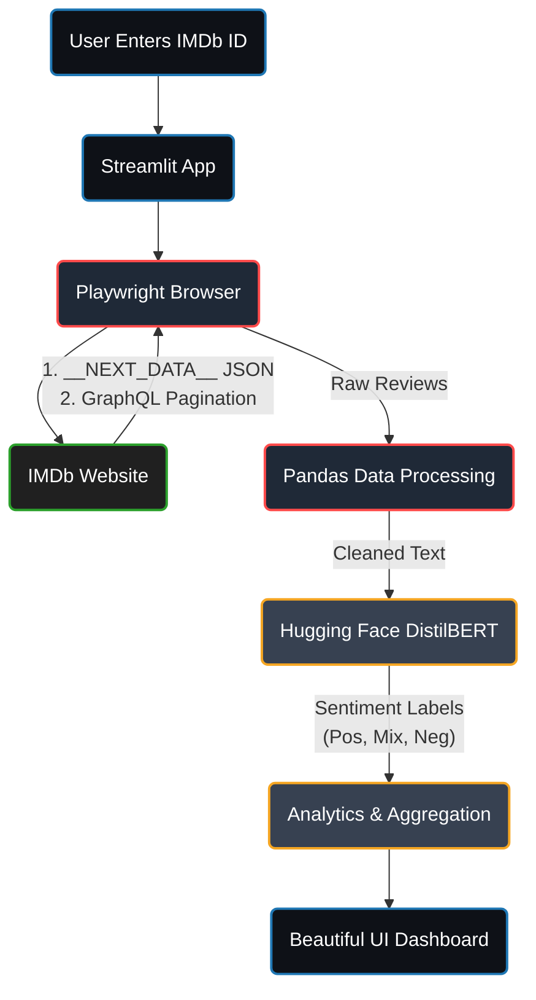

# 🎬 CineScope: Live IMDb Sentiment Analyzer

A modern, full-stack web application that **live-scrapes IMDb reviews in real-time** and uses a fine-tuned **Machine Learning** model to instantly evaluate audience sentiment. 

CineScope goes beyond basic ratings—it reads the actual text of hundreds of user reviews, categorizes them using a deep learning model, and generates a beautiful analytics dashboard showcasing polarization, helpfulness metrics, spoiler ratios, and highlight reviews.

Site_Link = https://webscraping-imdbrating.streamlit.app/

## 🌟 Features

- **Real-Time Scraping:** Live connects to IMDb to pull the absolute newest reviews.
- **Deep Learning Sentiment Analysis:** Uses a custom-trained DistilBERT model to classify review text into Positive, Mixed, or Negative.
- **Smart Data Parsing:** Intercepts IMDb's internal `__NEXT_DATA__` JSON states and utilizes GraphQL pagination for lightning-fast scraping.
- **Rich Dashboard:** Visualizes AI-predicted ratings, user rating distributions, polarization, and community engagement out of 100%.
- **Review Highlights:** Automatically extracts the "Most Helpful" positive and negative reviews directly to the dashboard.

---

## 🏗️ Architecture Flow



---

## 🛠️ Technology Stack

| Component | Technology Used | Purpose |
| :--- | :--- | :--- |
| **Frontend & App State** | [Streamlit](https://streamlit.io/) | Pure Python UI rendering, state management, and custom CSS injection for the premium dark dashboard. |
| **Web Scraping** | [Playwright](https://playwright.dev/) | Headless Chromium browser automation. Uses DOM-content loaded logic to parse JSON blobs and trigger GraphQL requests invisibly. |
| **Data Processing** | [Pandas](https://pandas.pydata.org/) | Cleans HTML, aggregates upvotes/downvotes, calculates string length averages, and prepares datasets. |
| **Machine Learning** | [Hugging Face Transformers](https://huggingface.co/) | Runs batch inference using a fine-tuned DistilBERT Sequence Classification pipeline directly on CPU. |
| **Tensor Computation** | [PyTorch](https://pytorch.org/) | The underlying engine computing the forward pass of our NLP model. |

---

## 🧠 How It Works

### 1. The Scraping Pipeline (`Playwright`)
Instead of slowly scraping HTML elements one by one, CineScope acts like a network engineer:
1. It navigates to the IMDb movie review page using a headless browser.
2. It extracts the raw `__NEXT_DATA__` JSON blob that IMDb uses to hydrate their React frontend. This allows us to get the first large batch of reviews instantly.
3. For subsequent pages, it reverse-engineers IMDb's `graphql` API endpoint, sending authenticated POST requests with a specific `sha256Hash` cursor to seamlessly paginate through hundreds of reviews without loading new pages.

### 2. The AI Pipeline (`Transformers`)
Once the raw reviews are downloaded, the texts are batched and tokenized. 
We host our model on the Hugging Face hub (`rish12112/cinescope-sentiment`). It uses a **DistilBERT** architecture that is light enough to run efficiently on Streamlit Community Cloud (via PyTorch CPU wheels) but powerful enough to understand nuance, sarcasm, and complex movie critiques.

---

## 🚀 Running Locally

If you want to run this project on your own machine, follow these steps:

### Prerequisites
- Python 3.11 (Highly Recommended)
- Git

### Installation

1. **Clone the repository:**
   ```bash
   git clone https://github.com/YOUR_USERNAME/Scrapper.git
   cd Scrapper
   ```

2. **Install Python dependencies:**
   ```bash
   pip install -r requirements.txt
   ```

3. **Install Playwright Browsers:**
   Playwright requires its own headless browser binaries to run:
   ```bash
   playwright install chromium
   ```

4. **Launch the Application:**
   ```bash
   streamlit run app.py
   ```

5. **View:** Open your browser to `http://localhost:8501`.

---

## ☁️ Deployment Notes (Streamlit Cloud)
To host this live on Streamlit Community Cloud:
- **Python Version:** Ensure you select **Python 3.11** in the advanced settings to ensure PyTorch and Playwright compile correctly.
- **CPU Wheels:** `requirements.txt` specifically utilizes `--extra-index-url https://download.pytorch.org/whl/cpu` to avoid downloading 2.5GB GPU wheels, saving memory limits.
- **packages.txt:** Contains system-level dependencies (like `libnss3`) required for Playwright to boot in the cloud container without throwing shared object (`.so`) errors.

---
*Created with ❤️ by Rishav*
